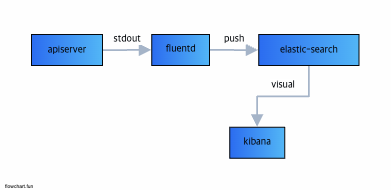

# Docker-Advanced Function

## 1. Logs

```
    docker logs tail -1 <container-name>

    docker run --name <container-name> --log-opt max-size=5k --log-opt max-file=3 <docker-iamges>

    docker run --name todo-server --log-opt max-size=5k --log-opt max-file=3 --network ff660b6a7a40 -p 3000:3000 -e PORT=3000  server_node-todo

    ## --log-opt max-size=5k 단일 로그 파일의 최대크기를 5kb
    ## --log-opt max-file=3 파일을 3개로 유지
```

## 2. Log Forwarding use Fluentd



```

```
